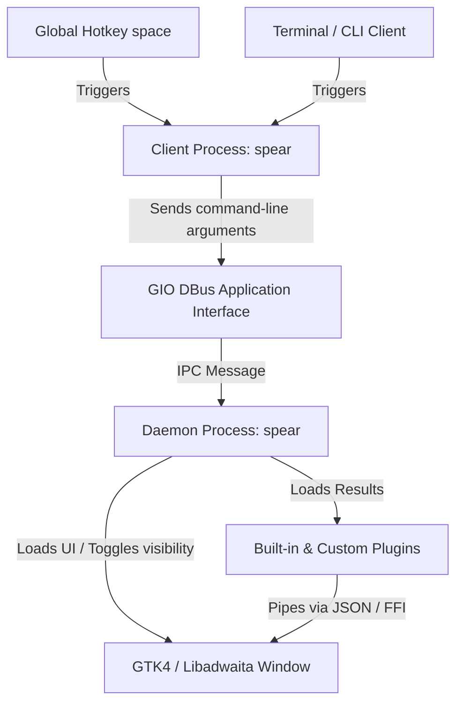

<p align="center">
  
</p>

<p align="center">
  
  
  
  
</p>

<p align="center">
  
</p>

A blazingly fast, Raycast-like launcher for GNOME built with **Rust** and **Libadwaita**.

Spear operates as a persistent background daemon, ensuring **0ms activation latency**. It features customizable themes, custom folder searches, image and text previews utilizing Nautilus-style system thumbnails, and a robust CLI client.

---

## 📐 Architecture & Code Design

Spear is split into a **Client-Daemon architecture** to achieve maximum activation speed while maintaining zero overhead when idle.



### 1. Persistent Daemon Design (GIO DBus IPC)
Normally, loading a GTK4 / Libadwaita window takes 100-300ms depending on hardware because it has to parse CSS styles, allocate OpenGL textures, and talk to the Wayland compositor. To bypass this latency:
* Spear runs a persistent daemon.
* When you launch the client (e.g. by pressing the hotkey or typing `spear`), the client simply starts a secondary lightweight process which forwards the command-line arguments to the running daemon via the GIO `ApplicationCommandLine` DBus IPC.
* The daemon receives the command, handles it (e.g., toggles visibility), and immediately reveals the already allocated window using a 0ms memory-resident toggle.

### 2. Low Memory & CPU Footprint
Unlike Electron-based alternatives (which bundle Chromium and Node.js, consuming **200MB - 500MB+ RAM**) or Python-based launchers (which consume **80MB - 150MB+ RAM**), Spear is built natively in compiled Rust.
* **Memory Usage**: Typically consumes **< 20MB of RAM** when idle in the background.
* **CPU Usage**: Consumes **0% CPU** when idle. Keystroke searching uses optimized thread pools that process queries in microseconds.

### 3. Wayland Compatibility & Dynamic Fallbacks
Wayland compositors prevent applications from randomly positioning themselves or capturing keyboard focus. Spear handles this natively:
* **Centering & Anchoring**: Spear dynamically loads the Wayland `gtk4-layer-shell` library at runtime.
* **Dynamic Library Fallback (`dlopen`)**: The binary does *not* link `gtk4-layer-shell` statically or dynamically at compile time. Instead, it attempts to load `libgtk4-layer-shell.so.0` using `dlopen` at runtime. If the library is missing (e.g. on host machines where developers have not installed the package), it falls back gracefully to a standard window without crashing.

---

## 🔍 Deep-Dive: Built-in Engines

### 1. Applications Engine (`apps`)
* **Behavior**: Parses GNOME desktop files (`.desktop`) from both system (`/usr/share/applications/`) and user (`~/.local/share/applications/`) directories.
* **Actions**: Launches the associated executable via `gio::DesktopAppInfo`, keeping track of startup notifications.

### 2. Calculator Engine (`calc`)
* **Behavior**: An internal, crate-free **Recursive-Descent Parser** (`MathParser`) built directly into the codebase. 
* **Supports**:
  - Constants: `pi` and `e`.
  - Operations: Addition (`+`), subtraction (`-`), multiplication (`*`), division (`/`), modulo (`%`), and exponents (`^`).
  - Trigonometry & Absolute Functions: `sin(x)`, `cos(x)`, `tan(x)`, `sqrt(x)`, and `abs(x)`.
* **Actions**: Instantly evaluates equations as you type. Pressing `Enter` copies the result value to the clipboard.

<p align="center">
  
</p>

### 3. File Explorer & Nautilus-style Previews (`files`)
* **Behavior**: Crawls configured file roots (e.g. `~/Downloads`, `~/Documents`) using optimized filesystem iterators.
* **Previews**:
  - **Text Files**: If the file is a text format and under 10MB, the right-hand preview panel displays the first 500 characters of file contents natively inside a scrolled text view.
  - **Images**: Displays the image directly inside the preview layout.
  - **System-style Previews**: Uses GNOME's native thumbnailing subsystem (the same APIs used by Nautilus) to generate and display thumbnails for PDFs, video frames, documents, and complex image files.
* **Actions**: Pressing `Enter` opens the file in the system default application.

<p align="center">
  
  
</p>

<p align="center">
  
</p>

### 4. Web Search (`web` & `youtube`)
* **Behavior**: Captures queries, suggesting triggers to search on search providers.
* **Customization**: The query parameters and URLs can be overridden in `config.json` (e.g. replacing Google search with DuckDuckGo or self-hosted SearXNG).

### 5. Terminal Command Runner (`command`)
* **Behavior**: Activates when typing the prefix character (default `>`).
* **Actions**: Spawns a background shell to run the typed terminal command.

---

## 🔌 Custom Plugins

Extending Spear is easy. You can write search providers in **any language** (Python, Node.js, Bash, Rust) and place them in `~/.config/spear/plugins/`.

### 1. Folder Structure
```
~/.config/spear/plugins/
└── my-custom-plugin/
    ├── manifest.json
    └── main.py  (or main.js, main.sh, etc.)
```

### 2. Manifest (`manifest.json`)
```json
{
  "name": "Weather Finder",
  "description": "Get current weather info",
  "keyword": "weather",
  "command": ["python3", "main.py"],
  "icon": "weather-clear-symbolic"
}
```
* `keyword` (Optional): If set, the plugin is only run when the query starts with the keyword. Otherwise, it runs globally.

### 3. Executable JSON Protocol
Your script receives the query as its last argument and must print a JSON list to `stdout`:

```json
[
  {
    "id": "weather-nyc",
    "title": "New York: 22°C",
    "subtitle": "Partly Cloudy - Click to view detailed forecast",
    "icon": "weather-few-clouds-symbolic",
    "score": 100,
    "actions": [
      {
        "label": "Open Forecast",
        "type": "open-url",
        "value": "https://weather.com/weather/today/l/USNY0996"
      },
      {
        "label": "Copy Temperature",
        "type": "copy-to-clipboard",
        "value": "22°C"
      }
    ]
  }
]
```

<p align="center">
  
</p>

---

## 📦 Installation & Setup

### Option A: Local User Installation (Recommended)
If you do not want to install anything system-wide, you can compile and install Spear to your local home directory.

1. **Compile & run installer**:
   Simply run the wrapper install script:
   ```bash
   ./install.sh
   ```
   *(Alternatively, you can run `cargo run --bin install` directly inside your container or host).*
   *This installer builds the release binary, places it in `~/.local/bin/spear`, configures autostart at `~/.config/autostart/spear.desktop`, and registers the global hotkey (`Alt+Space`) using `gsettings`.*

2. **Add to PATH**:
   If `~/.local/bin` is not already in your PATH, add the following line to your `~/.bashrc` or `~/.zshrc`:
   ```bash
   export PATH="$HOME/.local/bin:$PATH"
   ```
   Reload your shell profile: `source ~/.bashrc`.

3. **Start the daemon**:
   Run the launcher to spin up the daemon process:
   ```bash
   spear
   ```
   Toggle the visibility of the launcher using **`Alt + Space`**!

---

### Option B: Package Manager Build (DEB / RPM)
For system-wide deployment, you can package Spear into a native package.

#### 1. Debian Package (`.deb`)
Use `cargo-deb` to build the deb package:
```bash
cargo deb
```

#### 2. Red Hat Package (`.rpm`)
Use `cargo-generate-rpm` to build the RPM:
```bash
cargo generate-rpm
```

#### 3. Post-Install Session Setup
Since packages are installed system-wide in `/usr/bin/spear` (which doesn't run in the user's DBus/desktop context during package installation), each user must run the initialization setup once in their desktop session:
```bash
spear --init-setup
```
*This command checks if setup was already run (via a marker file at `~/.config/spear/.init_setup_done`). If not, it creates user configs, configures GNOME keyboard shortcuts, and adds `spear` to the user's desktop autostart.*

---

## 💻 CLI Client Reference

Once the daemon is active, manage it from the terminal:

| Command | Option | Description |
|---|---|---|
| `spear` | `-t`, `--toggle` | Toggle launcher window visibility |
| `spear --status` | `-s` | Query if the background daemon is active |
| `spear --list-plugins`| `-l` | List all internal & external active engines |
| `spear --config` | `-c` | Output path to the `config.json` file |
| `spear --quit` | `-q` | Cleanly terminate the background daemon |
| `spear --help` | `-h` | Print help guidelines |

---

## ⚙️ Configuration Reference

The configurations live in `~/.config/spear/config.json`.

| Key | Type | Default | Description |
|---|---|---|---|
| `shortcut` | String | `"<Alt>space"` | GNOME global hotkey mapping. |
| `theme` | String | `"adwaita"` | UI theme options: `adwaita`, `tokyonight`, `dracula`, `catppuccin`, `gruvbox`. |
| `color_scheme` | String | `"default"` | Color preference: `default`, `light`, `dark`. |
| `window_width` | Integer | `650` | Panel width in pixels. |
| `window_height` | Integer | `480` | Panel height in pixels. |
| `file_preview_enabled`| Boolean | `true` | Enable preview layouts. |
| `file_search_roots` | String | `"~/Documents, ~/Downloads"` | Directory list to search files inside. |
| `command_prefix` | String | `">"` | Trigger character for direct terminal execution. |

## 🗺️ Roadmap & Upcoming Features

We are planning to add several powerful native integration engines to Spear:

- **🎵 Media Controls**: Play, pause, skip, and view current playing track metadata (album art, title, artist) for MPRIS-compatible players (Spotify, Rhythmbox, etc.) directly in the launcher.
- **🖥️ Workspace & GNOME Shell Controls**: Seamlessly switch between active workspaces, create or delete workspaces, and search active windows.
- **🎛️ Window Controls**: Quick actions to minimize, maximize, tile, or close active application windows.
- **🧱 Native Window Tiling**: Custom tiling helper options to quickly snap windows to layouts (halves, quarters, custom grid ratios) on your GNOME desktop.

---

## 📄 License
This project is licensed under the MIT License.
