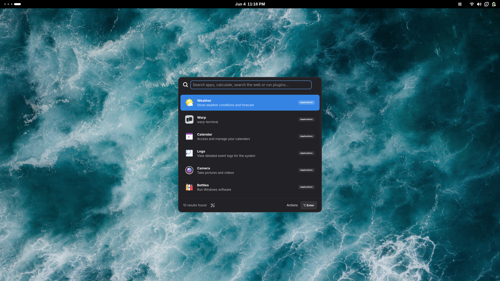
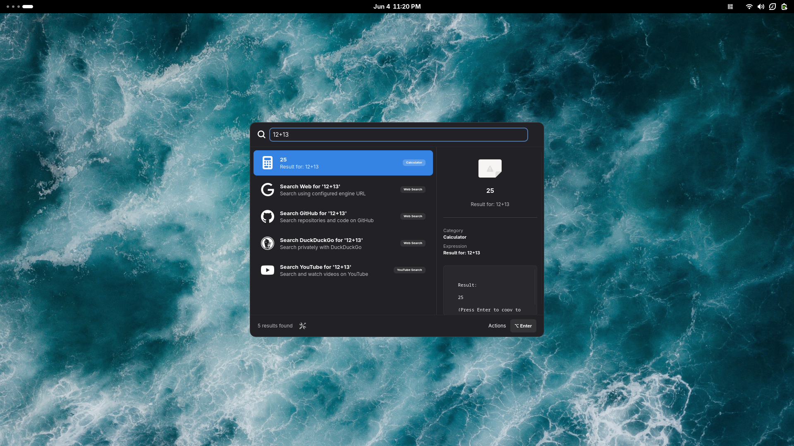
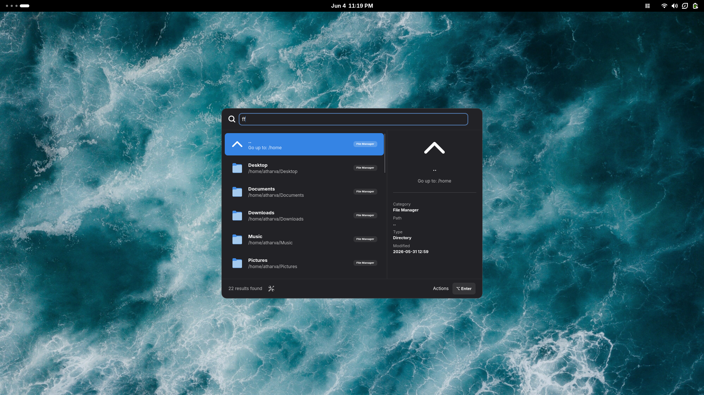
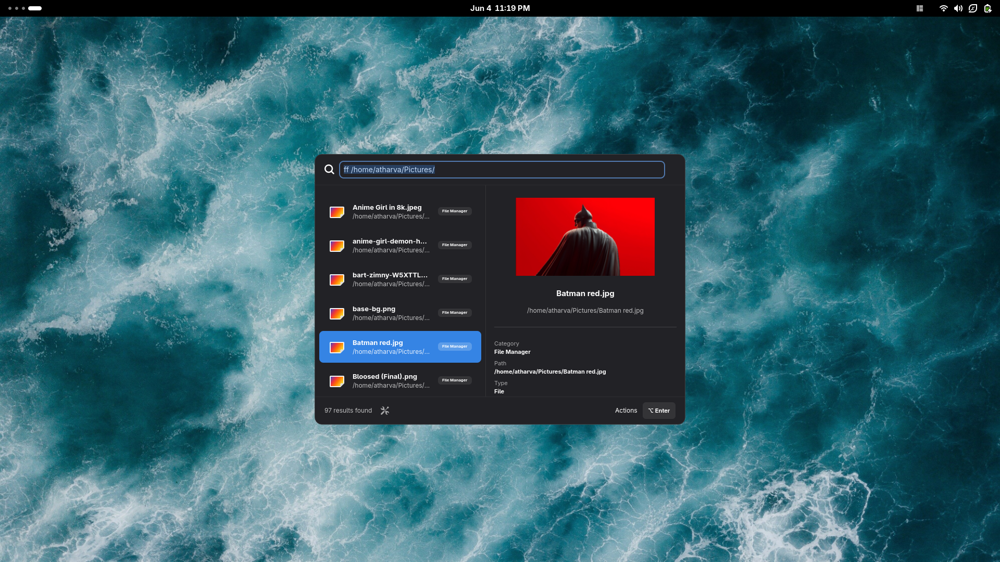
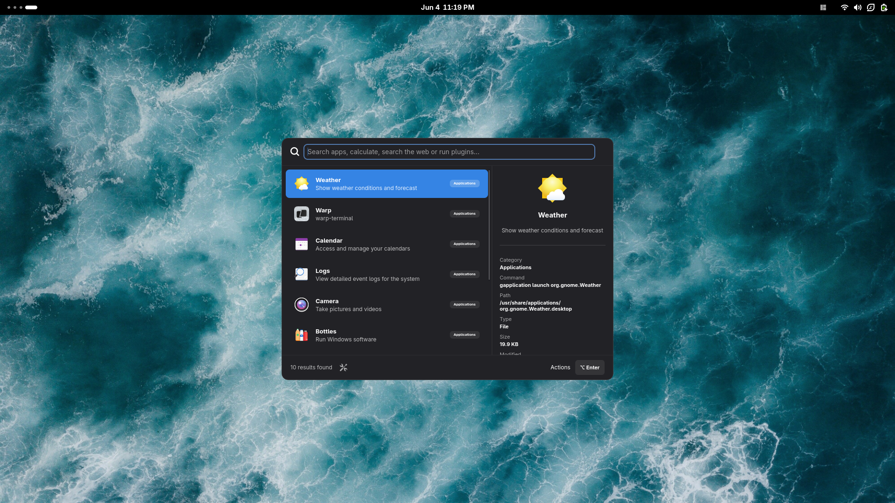

<p align="center">
  
</p>

<p align="center">
  
  
  
  
</p>

<p align="center">
  
</p>

After 8 years on Linux, I switched to Windows and got used to the convenience of launchers like Raycast and Flow Launcher. Returning to Linux, I deeply missed that polished workflow and the unified look of macOS. Spear is my attempt to bring that premium experience to Linux, using GNOME because of its consistent design code and unified Libadwaita theming.

---
## ✨ Features

## ✨ Features

<table>
<tr>
<td width="40%" align="center">
  
</td>
<td width="60%" valign="middle">
<h2>⚡ Lightning Fast</h2>
Opens instantly with minimal latency when triggered via your hotkey, staying out of your way until you need it.
</td>
</tr>

<tr>
<td width="60%" valign="middle">
<h2>📂 File Previews</h2>
Preview text files and images directly from search results using high-quality system thumbnails.
</td>
<td width="40%" align="center">
  
</td>
</tr>

<tr>
<td width="40%" align="center">
  
</td>
<td width="60%" valign="middle">
<h2>🖼️ Image Preview Engine</h2>
Browse and inspect images without opening a separate application.
</td>
</tr>

<tr>
<td width="60%" valign="middle">
<h2>🛠️ Built-in Engines</h2>
Includes application search, calculator mode, web search suggestions, and terminal command execution.
</td>
<td width="40%" align="center">
  
</td>
</tr>

<tr>
<td width="40%" align="center">
  
</td>
<td width="60%" valign="middle">
<h2>🔌 Custom Plugins</h2>
Create search providers and integrations in Python, Node.js, Bash, or any language capable of writing to stdout.
</td>
</tr>

<tr>
<td width="60%" valign="middle">
<h2>🎨 Native GNOME Aesthetics</h2>
Built with Libadwaita and designed to blend seamlessly with GNOME and popular themes like Tokyo Night, Dracula, Catppuccin, and Gruvbox.
</td>
<td width="40%" align="center">
  
</td>
</tr>
</table>

---

## 🚀 Installation

### Option A: Local Installation (Recommended)
If you want to install Spear locally to your home directory:

1. **Run the installer script**:
   ```bash
   ./install.sh
   ```
2. **Add to PATH**:
   If `~/.local/bin` is not in your PATH, add this to your `~/.bashrc` or `~/.zshrc`:
   ```bash
   export PATH="$HOME/.local/bin:$PATH"
   ```
3. **Start the launcher**:
   ```bash
   spear
   ```
   *Press **`Alt + Space`** to toggle the launcher!*

### Option B: Build Packages (DEB / RPM)
If you prefer to install Spear system-wide:

- **Debian Package (`.deb`)**:
  ```bash
  cargo deb
  ```
- **Red Hat Package (`.rpm`)**:
  ```bash
  cargo generate-rpm
  ```

*After installing the package, run `spear --init-setup` in your user session to configure autostart and hotkeys.*

---

## 🔌 Writing Plugins

Add custom search engines by placing a folder with `manifest.json` and a script in `~/.config/spear/plugins/`.

### Manifest (`manifest.json`)
```json
{
  "name": "Hello World",
  "keyword": "hello",
  "command": ["python3", "main.py"],
  "icon": "emblem-favorite-symbolic"
}
```

### Script Output Schema
Your script should print a JSON list of items to stdout:
```json
[
  {
    "id": "item-id",
    "title": "Item Title",
    "subtitle": "Item description",
    "icon": "mail-send-symbolic",
    "score": 100,
    "actions": [
      {
        "label": "Open Website",
        "type": "open-url",
        "value": "https://google.com"
      }
    ]
  }
]
```

---

## 🗺️ Roadmap

We plan to add more native features to Spear:
- **🎵 Media Controls**: Play, pause, skip, and see album art for media players.
- **🖥️ Workspace Switcher**: Quick window and workspace navigation.
- **🧱 Window Tiling**: Snapping window layouts (halves, quarters, custom grids).

---

## 📄 License
This project is licensed under the MIT License.
